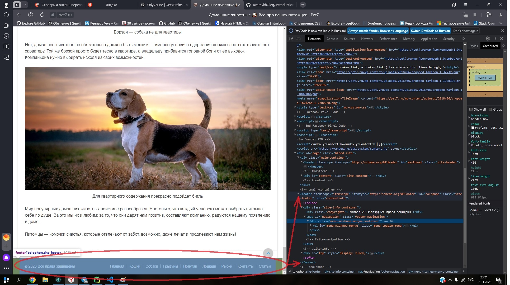

# Introduction-to-web-technologies
***
## Урок 1. Веб-технологии: вчера, сегодня, завтра.

### Задача

На основе сайта [Домашние животные](https://pet7.ru/ "Домашние животные"):

- Определите, на каком протоколе работает сайт.
- Проанализируйте структуру страницы сайта. Покажите в коде где хедер, футер и контент.
- Внесите не менее 3 изменений на страницу с помощью инструмента разработчика и представьте 
скриншоты было/стало.
- Создайте прототип низкой детализации.

Сдайте в виде zip-архива со скриншотами результатов, назовите файл по смыслу работы. 
ИЛИ можете использовать сервис [Notion](https://www.notion.so/ "Notion") или, в идеале, Гит.

Зарегистрируйтесь на хостинге.

[Задача на сайте GB](https://gb.ru/lessons/373632/homework "GeekBrains")
***

### Решение задачи

1. Сайт работает на протоколе `HTTPS` – безопасном протоколе передачи данных, 
который поддерживает шифрование посредством криптографических протоколов SSL и TLS, 
и является расширенной версией протокола HTTP.

***
2. 
### `Header` 
- (шапка сайта) - верхняя область на сайте, предназначена для облегчения навигации
по странице, первый элемент, который привлекает внимание пользователя. С помощью хедера 
посетитель сайта понимает, где находится, как перейти в следующий раздел и найти нужную 
информацию.

### `Footer` 
- (подвал сайта) - нижняя область на сайте, предназначена для логического завершения 
страницы, облегчения навигации и размещения дополнительных страниц.

### `Сontent`
- информационное наполнение страниц сайта, это могут быть статьи блога, карточки товара, 
тексты страниц, фотографии, видеообзоры — все, что несёт смысловую нагрузку.

***
3. 
### `До внесения изменений:`

### `После внесения изменений:`

***
4.
### `Регистрация на хостинге:`

***
5.
### `Прототип низкой детализации:`
[Прототип низкой детализации](https://app.moqups.com/Zo64Jle2GupoQl8hAb5uXOFEzVUAupHK/view/page/ad64222d5 "Прототип низкой детализации")

